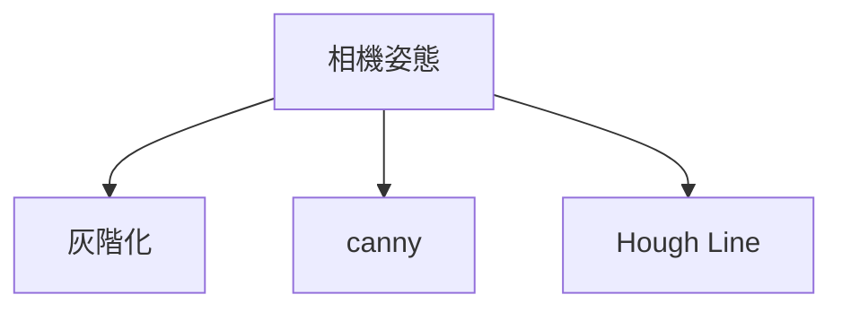

# 室內手機相機姿態
## 專案流程
輸入照片 -> 灰階化 -> canny -> Hough Line -> 找出視線消失點 -> 用相機內參數(fx,fy,cx,cy)回推相機旋轉矩陣 R ->轉成 yaw/roll/pitch
## breakdown

```mermaid
graph TD
  A[相機姿態] -->B[灰階化]
  A --> C[canny]
  A --> D[Hough Line]
```
