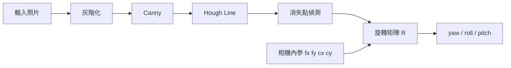
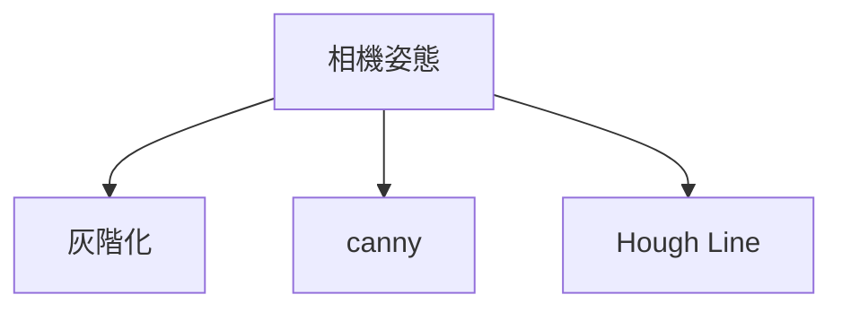

# 室內手機相機姿態
本專案是將拍攝到的照片做相機姿態偵測，利用照片中的直線結構，例如牆角、地板線、門框等，先用 Canny 和 Hough Transform 偵測線段，再根據線段交會得到消失點。
由於室內環境多半符合 Manhattan World，也就是三個主要方向互相垂直，因此可以利用消失點與相機內參反推相機旋轉矩陣，最後將旋轉矩陣轉換成 yaw、pitch、roll。
## 專案流程

## breakdown

