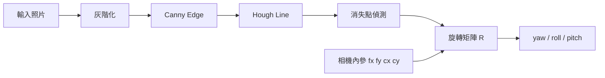
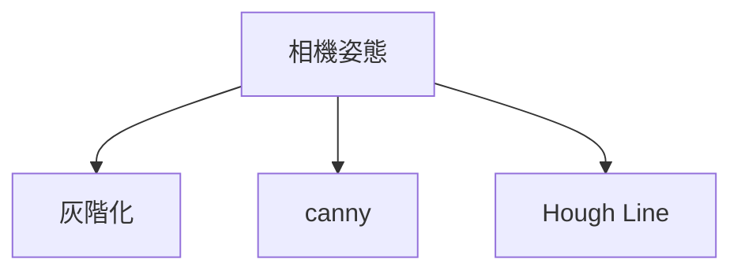

# 室內手機相機姿態
## 專案流程

```mermaid
graph LR
    A[輸入照片] --> B[灰階化]
    B --> C[Canny Edge]
    C --> D[Hough Line]
    D --> E[消失點偵測]

    E --> G[旋轉矩陣 R]
    F[相機內參 fx fy cx cy] --> G

    G --> H[yaw / roll / pitch]
```
## breakdown

```mermaid
graph TD
  A[相機姿態] -->B[灰階化]
  A --> C[canny]
  A --> D[Hough Line]
```
