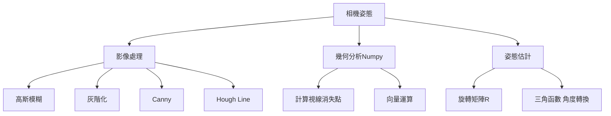
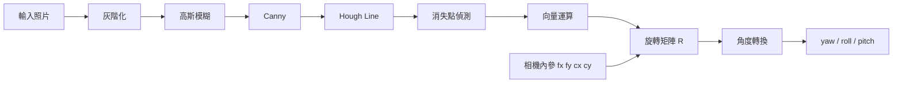

# 室內手機相機姿態
本專案是將拍攝到的照片做相機姿態偵測，利用照片中的直線結構，例如牆角、地板線、門框等，先用 Canny 和 Hough Transform 偵測線段，再根據線段交會得到消失點。
由於室內環境多半符合 Manhattan World，也就是三個主要方向互相垂直，因此可以利用消失點與相機內參反推相機旋轉矩陣，最後將旋轉矩陣轉換成 yaw、pitch、roll。
## 專案需求
1. 功能:
   
   室內、室外拍攝照片
   
   可輸入灰階或彩色照片
   
   檔案:照片
   
3. 效能:
   
   640*480
4. 介面:
   
   原圖照片

   
   原圖照片+Hough Line+視線消失點+相機坐標軸+yaw、pitch、roll文字輸出
5. 限制:
   
   硬體:RasberyPi

## 系統分析

## 專案流程

## 方塊解釋
| name | what | why | how |
|-----|------|-----|-----|
| 輸入照片 | 輸入資料可彩色或灰階 | 從影像中取得資訊 | 使用opencv讀取影像 |
| 灰階化 | 將RGB轉成灰階影像 | canny與Hough Transform不需要顏色，只需要亮度變化 | opencv: gray=cv2.cvtColor(img,cv2.COLOR_BGR2GRAY) |
| 高斯模糊 | 利用 Gaussian Filter 平滑影像 | 去除高頻雜訊 | opencv: blur=cv2.GaussianBlur(gray,(5,5),0) Kernel(模糊範圍)越大雜訊越少細節損失越多 |
| canny | 利用亮度變化找出影像的邊界 | 幫助Hough Line找線條 | opencv: edges=cv2.Canny(gray,50,150) |
| Hough Line | 霍夫直線轉換找出直線 | 視線消失點是由多條直線交會產生 | opencv: cv2.HoughLinesP(edges,rho=1,theta=np.pi/180, threshold=60,投票門檻 minLineLength=50,最短線段 maxLineGap=15)最大間距 |
| 消失點偵測 | 多條線段交會位置 | 估算yaw/pitch | 計算任兩條的焦點在取中位數 |
| 向量運算 | 將消失點轉換成三維方向向量 | 消失點是2D座標旋轉矩陣要3D方向向量 | 利用fx,fy,cx,cy建立方向向量 |
| 相機內參 | 相機成像模型參數 | 2D轉3D的幾何關係，若無內參無法建立正確方向向量 | 目前使用近似值fx=fy=0.8*width cx=width/2 cy=height/2 |
| 旋轉矩陣 | 相機在三維空間中的旋轉狀態 | Yaw、Pitch、Roll並不是直接由消失點取得，必須先建立旋轉矩陣 | 利用xyz方向建立R=[x,y,z] |
| 角度轉換 | 將旋轉矩陣轉換為Yaw、Pitch、Roll | 矩陣不容易了解，角度比較清楚 | 透過 Euler Angle(歐拉角) 分解 |
| Yaw、Pitch、Roll | 最終輸出 | 描述相機姿態 | 由旋轉矩陣轉換得到 |

## 執行結果
### 室內

### 室外

## 驗證

